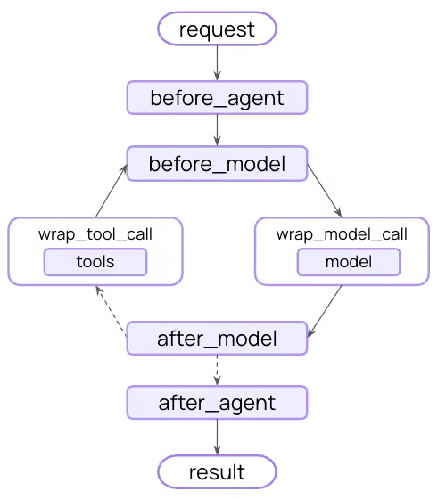

# 1. Guardrails 安全护栏

任何一个程序上线，都有安全和合规要求。guardrails 护栏,就是用于在关键节点对内容进行验证和过滤，以构建安全合规的AI应用程序。

那这些关键节点是什么节点呢？使用langchain 构建的AI应用程序，有下面这些回调钩子（关键节点）。



我们常用的钩子如下，这些钩子命名得非常好，见名知义。

- before_agent
- after_agent
- before_model
- after_model

# 2. PII内置中间件

对于一些常用、确定的防护内容，langchain做了中间件的封装 —— PIIMiddleware。

PII - Personaly Identifiable Information, 个人身份信息。

```python
PIIMiddleware(
  self,
  pii_type: Literal['email', 'credit_card', 'ip', 'mac_address', 'url'] | str,
  *,
  strategy: Literal['block', 'redact', 'mask', 'hash'] = 'redact',
  detector: Callable[[str], list[PIIMatch]] | str | None = None,
  apply_to_input: bool = True, # 应用于输入，对应 before_agent 钩子
  apply_to_output: bool = False, # 应用于输出，对应 after_agent 钩子
  apply_to_tool_results: bool = False # 应用于工具输出结果，对应 wrap_tool_call 钩子
)
```
## 2.1 pii_type

- email: 邮箱
- credit_card: 信用卡
- ip: IP地址
- mac_address: MAC（Media Access Control） 地址
- url: url地址

## 2.2 strategy

- block: 抛出错误
- redact: 使用 [REDACTED_TYPE] 替换敏感信息
- mask: 部分遮掩个人身份信息 (例如 ****-****-****-1234 )
- hash: 用确定性哈希值替换PII数据 (例如 <email_hash:a1b2c3d4>)

下面是一个demo。里面使用到了很多个钩子回调函数，主要是方便大家消息的变化。

- handle_before_agent
- handle_before_model
- handle_wrap_tool_call
- handle_wrap_model_call
- handle_after_model
- handle_after_agent


```python
from collections.abc import Callable

from langchain.agents import create_agent
from langchain.agents.middleware import PIIMiddleware, before_agent, after_agent, AgentState, before_model, after_model, wrap_tool_call, wrap_model_call, ModelRequest, ModelResponse
from langgraph.runtime import Runtime
from langchain.messages import ToolMessage
from langchain.tools.tool_node import ToolCallRequest
from langgraph.types import Command

@before_agent
def handle_before_agent(state: AgentState, runtime: Runtime):
    latest_message = state.get("messages", [])[-1]
    if not latest_message:
        return
    print(f"before_agent:{latest_message.content}")
    print("-" * 100)

@after_agent
def handle_after_agent(state: AgentState, runtime: Runtime):
    latest_message = state.get("messages", [])[-1]
    if not latest_message:
        return
    print(f"after_agent:{latest_message.content}")
    print("-" * 100)

@before_model
def handle_before_model(state: AgentState, runtime: Runtime):
    latest_message = state.get("messages", [])[-1]
    if not latest_message:
        return
    print(f"before_model:{latest_message.content}")
    print("-" * 100)

@after_model
def handle_after_model(state: AgentState, runtime: Runtime):
    latest_message = state.get("messages", [])[-1]
    if not latest_message:
        return
    print(f"after_model:{latest_message.content}")
    print("-" * 100)

@wrap_tool_call
def handle_wrap_tool_call(request: ToolCallRequest,
    handler: Callable[[ToolCallRequest], ToolMessage | Command],
) -> ToolMessage | Command:
    print(f"Executing tool: {request.tool_call['name']}")
    print(f"Arguments: {request.tool_call['args']}")

    result = handler(request)
    print("Tool completed successfully")
    return result

@wrap_model_call
def handle_wrap_model_call(request: ModelRequest,
    handler: Callable[[ModelRequest], ModelResponse],):
    latest_message = request.messages[-1]
    if not latest_message:
        return handler(request)
    print(f"wrap_model_call:{latest_message.content}")
    print("-" * 100)
    return handler(request)

agent = create_agent(
    model="ollama:qwen3:latest",
    tools=[],
    middleware=[
        # Redact emails in user input before sending to model
        PIIMiddleware(
            "email",
            strategy="redact",
            apply_to_input=True,
        ),
        # Mask credit cards in user input
        PIIMiddleware(
            "credit_card",
            strategy="mask",
            apply_to_input=True,
        ),
        # Block API keys - raise error if detected
        PIIMiddleware(
            "api_key",
            detector=r"sk-[a-zA-Z0-9]{32}",
            strategy="hash", # hash | block(抛出异常)
            apply_to_input=True,
            apply_to_output=True,
        ),
        handle_before_agent,
        handle_before_model,
        handle_wrap_tool_call,
        handle_wrap_model_call,
        handle_after_model,
        handle_after_agent,
    ]
)

result = agent.invoke({
        "messages": [
            # {
            #     "role": "user",
            #     "content": "请拉取 1527161981@qq.com 的邮件列表！"
            # },
            # {
            #     "role": "user",
            #     "content": "4111111111111111 这个信用卡的额度是你每个月可以花费的token金额！"
            # },
            {
                "role": "user",
                "content": "我的API_Key为:sk-7096d73804b24r6u7b17bef928e2f1e2,为什么一直调不通deepseek的API呢？我搞错了吗？"
            },
        ]
    }
)

print(result)
```

## 2.3 自定义detector

detector可以是一个函数(fn(str) -> list[PIIMatch]),也可以是一个字符串。

如果我们要把国内电话号码屏蔽的话，可以这么定一个一个函数。

```python
def detect_cn_phone(content: str) -> list[dict]:
    matches = []
    pattern = r"(?<!\d)1[3-9]\d{9}(?!\d)"

    for match in re.finditer(pattern, content):
        matches.append({
            "text": match.group(0),   # 匹配到的原文
            "start": match.start(),   # 起始位置
            "end": match.end(),       # 结束位置
        })

    return matches

agent = create_agent(
    model="ollama:qwen3:latest",
    tools=[],
    middleware=[
        PIIMiddleware(
            pii_type="cn_phone",
            detector=detect_cn_phone,
            strategy="mask",
            apply_to_input=True,
        ),
        handle_before_agent,
        handle_before_model,
        handle_wrap_tool_call,
        handle_wrap_model_call,
        handle_after_model,
        handle_after_agent,
    ],
)
```


# 3. 自定义guardrail

langchain内置的PII中间件其实比较有限。实际的业务开发中，可能我们需要自己定义安全护栏。
举一个简单例子，我们可以列出违禁词汇，定义一个钩子函数，当检测到违禁词汇时，直接结束。

```python
from langchain.agents.middleware import before_agent, AgentState
from langgraph.runtime import Runtime

forbidden_list = [
    "暴力",
    "血腥",
    "自残",
    "自杀",
    "毒品",
    "诈骗",
    "洗钱",
    "赌博",
    "仇恨",
    "歧视",
    "色情",
    "恐怖主义",
    "爆炸物",
    "枪支",
    "黑客",
    "盗号",
    "木马",
    "勒索软件",
]

@before_agent(can_jump_to=["end"])
def custom_guardrail(state: AgentState, runtime: Runtime):
    messages = state.get("messages", [])
    latest_message = messages[-1] if messages else None
    if not latest_message:
        return None

    content = latest_message.content
    if not isinstance(content, str):
        content = str(content)

    matched_words = [word for word in forbidden_list if word in content]
    if not matched_words:
        return None

    return {
        "jump_to": "end",
        "messages": [
            AIMessage(
                content=(
                    "检测到输入中包含敏感或违规词汇，已阻止本次请求。"
                    f"命中词语: {', '.join(matched_words)}"
                )
            )
        ],
    }
```

# 4. 更多信息

1. demo地址
- https://github.com/suifengfengye/dxh_playground/tree/main/2026-mashibing/20260802-guardrails

2. langchain文档参考
- https://docs.langchain.com/oss/python/langchain/guardrails