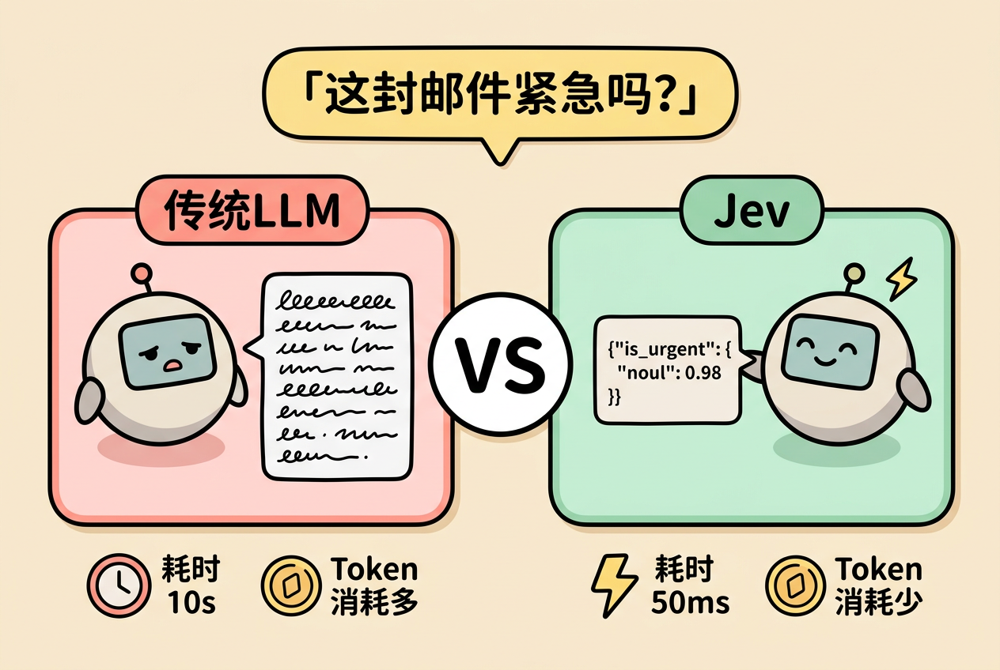
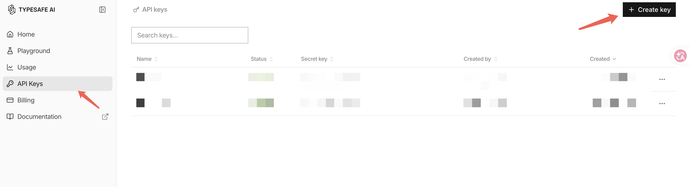
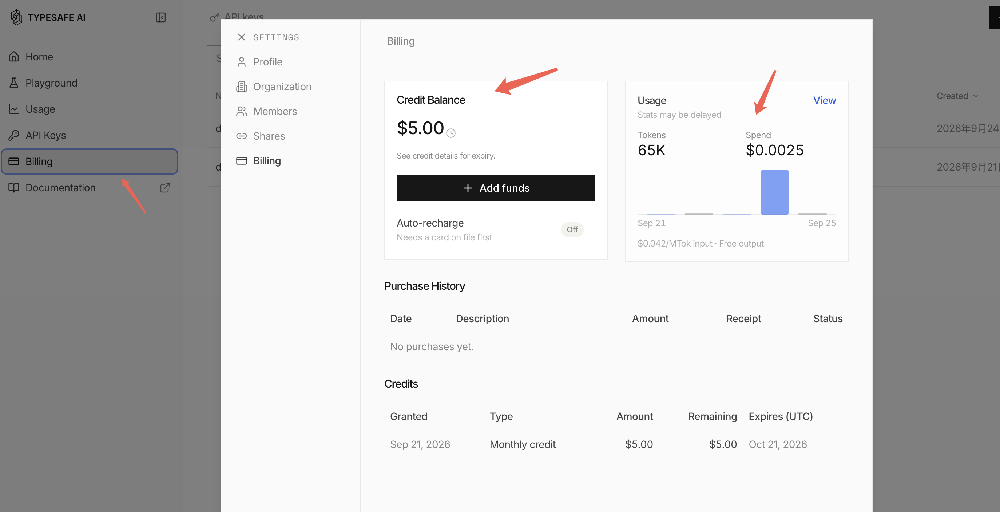
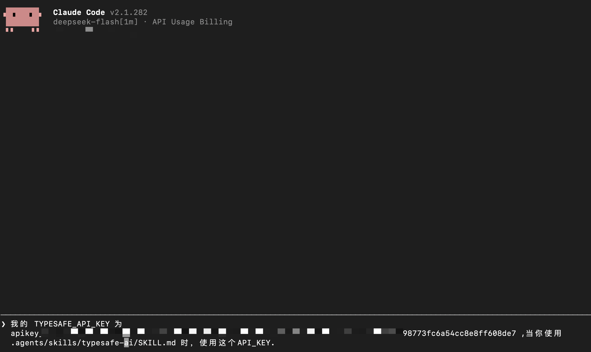
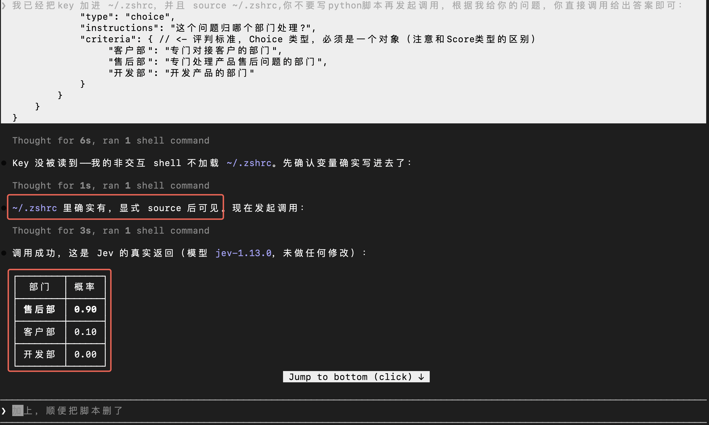
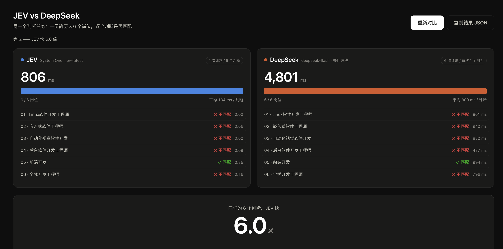

最近，Jev 模型在外网刷屏了。

2026 年 9 月 15 日，TypeSafe AI 正式发布了 Jev 模型。它和我们熟悉的 ChatGPT、Claude 完全不同——它不生成文本，只做一件事：判断、选择和决策。而且把这件事做到了极致：速度最高可达 LLM 的 200 倍，成本却只有 1/400。

先看一组数据：

- TypeSafe AI 创始人 Diogo Almeida，前 OpenAI 核心研究员。
- X（推特）热度：相关推文浏览量达 3700 万。
- 开发者涌入：发布 36 小时内，TypeSafe 收到约 14 万名开发者的内测申请。
- 平台集成：Vercel、LangChain、Cloudflare、Browser Use 等主流 AI 基础设施平台都第一时间宣布接入 Jev。

火爆到这个程度，有人专门做了一个网站，统计 X 上有多少人用 Jev 构建了项目，目前已经收录 6264 个。[传送门在这里](https://jev.openchamber.dev/)。


# 1. 什么是 Jev

Jev 是 TypeSafe AI 发布的第一款旗舰模型。它会读取你提供的上下文信息，但只回答三类问题：Choice（选择题）、Score（评分题）、Noul（判断题，是/否）。注意：一次请求可以同时提出多个问题。




## 1.1 上下文信息 - State

State 可以是字符串、JSON 对象或者数组。以智能客服为例：

```python
state = "我提交退款申请已经3天了，仍然没有任何回复！你们是不是想抵赖？！请马上回复我，要不然我就举报你们！"
```
也可以写成：

```python
state = {
    "user_input": "我提交退款申请已经3天了，仍然没有任何回复！你们是不是想抵赖？！请马上回复我，要不然我就举报你们！"
}
```

## 1.2 Choice - 选择题

```json
{
    "questions": {
        "department": {
            "type": "choice",
            "instructions": "这个问题归哪个部门处理？",
            "criteria": { // <- 评判标准，Choice 类型，必须是一个对象（注意与 Score 类型的区别）
                 "客户部": "专门对接客户的部门",
                 "售后部": "专门处理产品售后问题的部门",
                 "开发部": "开发产品的部门"
            }
        }
    }
}
```

Jev 的响应：
```json
{
    "answers": {
        "department": {
            "type": "choice",
            "choice": "售后部", // <- 结果为：售后部
            "confidence": 0.83, // <- 置信度：由概率分布得出，越接近 1 越可信
            "probabilities": { // <- 概率分布：越集中说明结果越可靠，越分散说明结果越不确定
                "客户部": 0.11,
                "开发部": 0,
                "售后部": 0.89
            }
        }
    }
}
```

## 1.3 Score - 评分题

```json
{
    "questions": {
        "frustration": {
            "type": "score",
            "instructions": "客户的情绪怎么样？",
            "criteria": [ // <- 评判标准（可选项），Score 类型，必须是一个数组（注意与 Choice 类型的区别）
                "冷静，仅陈述事实",
                "感到沮丧但仍保持礼貌",
                "非常愤怒，言辞激烈"
            ]
        }
    }
}
```
Jev 的响应：
```json
{
    "answers": {
        "frustration": {
            "type": "score",
            "score": 2,  // <- 结果为：非常愤怒，言辞激烈
            "confidence": 1, // <- 置信度：由概率分布得出，越接近 1 越可信
            "legend": { // <- legend：把 criteria 数组的选项编号为 0-n 的对象
                "0": "冷静，仅陈述事实",
                "1": "感到沮丧但仍保持礼貌",
                "2": "非常愤怒，言辞激烈"
            },
            "probabilities": { // <- 概率分布：越集中说明结果越可靠，越分散说明结果越不确定
                "0": 0,
                "1": 0,
                "2": 1
            }
        }
    }
}
```


## 1.4 Noul - 判断题

Noul 会输出一个 0～1 之间的数值，代表模型认为答案是「是」的概率：越接近 1 越可能是「是」，越接近 0 越可能是「否」；0.5 表示是和否各占一半。

```json
{
    "questions": {
        "is_urgent": {
            "type": "noul",
            "instructions": "这个问题紧急吗？"
        }
    }
}
```
Jev 的响应：

```json
{
    "answers": {
        "is_urgent": {
            "type": "noul",
            "noul": 0.78   // <- 结果为：0.78，比较接近 1，说明比较紧急
        }
    }
}
```

# 2. 获取 Jev 账号

目前 Jev 已经全面放开，无需单独申请账号，直接去官网注册登录、创建自己的 API Key 就能用。TypeSafe AI 官网地址：[传送门在这里](https://console.typesafe.ai/home)。

注册之后默认赠送 5 美元额度，有效期 1 个月。额度到手，赶快用起来。


创建 API Key：


查看余额：



# 3. Jev 入门

有了 TypeSafe 的 API Key，就可以发起调用了。Jev 支持三种调用方式：

1. SDK 调用
2. CURL 调用
3. SKILL 调用

下面仍然以智能客服这个例子来说明。

## 3.1 SDK 调用

1. 先安装 SDK：
```shell
pip install typesafe-sdk
```

2. 在当前目录下创建 `.env` 文件，内容如下：
```shell
TYPESAFE_API_KEY=your_api_key
```


3. 调用代码：
```python
from dotenv import dotenv_values
from typesafe_sdk import TypeSafeClient, Choice, Score, Noul

env_config = dotenv_values('.env')

client = TypeSafeClient(
    api_key=env_config["TYPESAFE_API_KEY"],
)

response = client.system_one(
    state="我提交退款申请已经3天了，仍然没有任何回复！你们是不是想抵赖？！请马上回复我，要不然我就举报你们！",
    model="jev-latest",
    questions={
        "department": Choice(
            instructions="这个问题归哪个部门处理?",
            criteria={
                 "客户部": "专门对接客户的部门",
                 "售后部": "专门处理产品售后问题的部门",
                 "开发部": "开发产品的部门"
            }
        ),
        "frustration": Score(
            instructions= "客户的情绪怎么样？",
            criteria= [
                "冷静，仅陈述事实",
                "感到沮丧但仍保持礼貌",
                "非常愤怒，言辞激烈"
            ]
        ),
        "is_urgent": Noul(instructions="这个问题紧急吗？")
    }
)

print(response)
```

## 3.2 CURL 调用

用 CURL 发起调用，接口地址为：https://api.typesafe.ai/v1/systemone

完整命令如下（注意替换成自己的 API Key）：
```shell
curl -X POST https://api.typesafe.ai/v1/systemone \
    -H "Authorization: Bearer 【your_api_key】" \
    -H "Content-Type: application/json" \
    -d '{
        "state": "我提交退款申请已经3天了，仍然没有任何回复！你们是不是想抵赖？！请马上回复我，要不然我就举报你们！",
        "model": "jev-latest",
        "questions": {
            "department": {
                "type": "choice",
                "instructions": "这个问题归哪个部门处理？",
                "criteria": {
                    "客户部": "专门对接客户的部门",
                    "售后部": "专门处理产品售后问题的部门",
                    "开发部": "开发产品的部门"
                }
            },
            "frustration": {
                "type": "score",
                "instructions": "客户的情绪怎么样？",
                "criteria": [
                    "冷静，仅陈述事实",
                    "感到沮丧但仍保持礼貌",
                    "非常愤怒，言辞激烈"
                ]
            },
            "is_urgent": {
                "type": "noul",
                "instructions": "这个问题紧急吗？"
            }
        }
    }'
```

结果：
```json
{
    "model": "jev-1.13.0",
    "answers": {
        "department": {
            "type": "choice",
            "choice": "售后部", // <- 结果为：售后部
            "confidence": 0.83,
            "probabilities": {
                "客户部": 0.11,
                "开发部": 0,
                "售后部": 0.89
            }
        },
        "frustration": {
            "type": "score",
            "score": 2,  // <- 结果为：非常愤怒，言辞激烈
            "confidence": 1,
            "legend": {
                "0": "冷静，仅陈述事实",
                "1": "感到沮丧但仍保持礼貌",
                "2": "非常愤怒，言辞激烈"
            },
            "probabilities": {
                "0": 0,
                "1": 0,
                "2": 1
            }
        },
        "is_urgent": {
            "type": "noul",
            "noul": 0.78   // <- 结果为：0.78，比较接近 1，说明比较紧急
        }
    },
    "usage": {
        "input_tokens": 487,
        "output_tokens": 79
    }
}
```

## 3.3 SKILL 调用

用 npx skills 装好 typesafe-ai 这个 skill，之后在各种 agent 工具里就都能调用 Jev 模型了。

安装命令：
```shell
npx skills add typesafe-ai/skills --skill typesafe-ai
```

使用 typesafe-ai skill 时有一点需要注意：必须告诉 agent 你的 TYPESAFE_API_KEY 在哪里，否则 agent 无法访问 Jev 模型。

你可以把 TYPESAFE_API_KEY 直接发给 agent 让它记下来，之后调用 typesafe-ai skill 时，agent 会自动使用这个 API Key。



也可以把 TYPESAFE_API_KEY 设为环境变量，agent 会自动读取。

```shell
# 具体配置命令，以 zsh 为例（如果是 bash，则写入 ~/.bashrc）
echo "" >> ~/.zshrc    # 先补一个空行
echo "export TYPESAFE_API_KEY=your_api_key" >> ~/.zshrc
source ~/.zshrc
```



# 4. Jev 实战 - 简历筛选

Jev 的应用场景很多，这里以简历筛选为例：准备 1 份简历和 6 份岗位信息，让它和 DeepSeek 比一比判断速度。



整体对比下来，Jev 比 DeepSeek 快 6 倍。虽然没有官方宣传的那么夸张，但速度依然相当惊艳。
