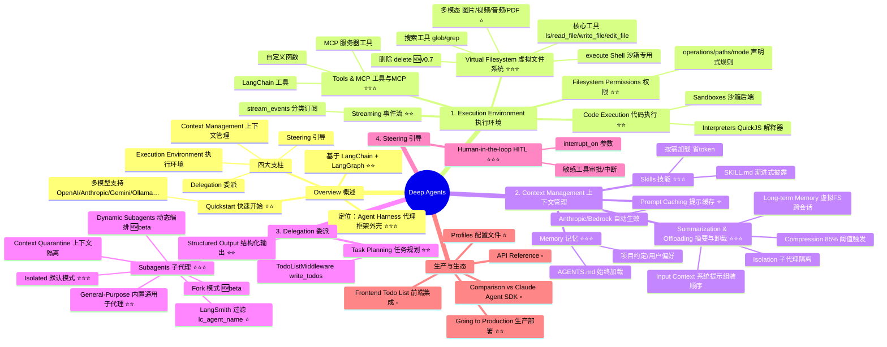

# Deep Agents 官方文档 · 思维导图

> 数据来源：https://docs.langchain.com/oss/python/deepagents/overview
>
> 图例说明：
> - ⭐️⭐️⭐️ = **核心特性**（Deep Agents 立身之本，必须重点掌握）
> - ⭐️⭐️   = **重要能力**（生产环境常用）
> - ⭐️     = **一般能力**（可按需了解）
> - ▫️     = **边角/辅助能力**（略过不影响主线理解）
> - 🆕     = 新增或 Beta 特性

---

## 一、Mermaid 思维导图（推荐用支持 Mermaid 的 Markdown 预览查看）

---

## 二、文本大纲版（不依赖 Mermaid）

### 🌳 Deep Agents

- **概念定位** ⭐️⭐️⭐️
  - 一个 "Agent Harness"（代理框架外壳）
  - 构建于 LangChain + LangGraph 之上
  - 提供持久化执行、流式、HITL 等运行时能力

---

#### 一、Execution Environment 执行环境

- **Tools & MCP** ⭐️⭐️⭐️  
  统一接入：自定义函数、LangChain 工具、MCP 服务器
- **Virtual Filesystem 虚拟文件系统** ⭐️⭐️⭐️  
  - 基础：`ls` / `read_file` / `write_file` / `edit_file`
  - 检索：`glob` / `grep`
  - 破坏性：`delete` 🆕（>=0.7）
  - 沙箱：`execute` shell 命令
  - 多模态支持：图片 / 视频 / 音频 / PDF / PPT ⭐️
- **Filesystem Permissions** ⭐️⭐️  
  声明式规则（operations / paths / mode）
- **Code Execution 代码执行** ⭐️⭐️
  - Sandbox 后端（`execute`）
  - Interpreters（QuickJS 的 `eval`）
- **Event Streaming 事件流** ⭐️⭐️  
  `stream_events` 按 subagents / messages / tool_calls / values 分类订阅

---

#### 二、Context Management 上下文管理

- **Skills 技能** ⭐️⭐️⭐️
  - 遵循 Agent Skills 标准，`SKILL.md`
  - **渐进式披露**：启动只读 frontmatter，命中才加载正文
  - 单一职责、避免重叠
- **Memory 记忆** ⭐️⭐️⭐️
  - `AGENTS.md`，**始终注入** 系统提示
  - 存放项目约定、用户偏好、通用规则
  - 关键：保持精简
- **Summarization & Context Offloading** ⭐️⭐️⭐️
  - **系统 Prompt 组装顺序**：system_prompt → base → memory → skills → FS → subagent → 中间件 → HITL
  - **自动卸载**：单次工具输入/结果 > 20,000 tokens 即写入 FS，仅保留指针 + 预览
  - **摘要触发**：占用模型 `max_input_tokens` 的 85%，保留最近 10%
  - `SummarizationMiddleware` + 主动 `compact_conversation` 工具
  - **上下文隔离**：委派给 subagent
  - **长期记忆**：用虚拟 FS 跨线程持久化
- **Prompt Caching 提示缓存** ⭐️  
  自动应用于 Anthropic / Bedrock

---

#### 三、Delegation 委派

- **Subagents 子代理** ⭐️⭐️⭐️（Deep Agents 的招牌能力）
  - **核心价值**：Context Quarantine —— 解决上下文膨胀，主代理只收最终结果
  - **两种定义**：`SubAgent`（字典/简易）· `CompiledSubAgent`（LangGraph 图/复杂）
  - **两种运行模式**：
    - `isolated`（默认）—— 全新上下文，可再调 `task` ⭐️⭐️⭐️
    - `fork` —— 继承父代理历史，不能再委派 🆕 beta
  - **Dynamic Subagents** 🆕 beta —— 通过代码解释器循环/并行派发
  - **General-Purpose Subagent**：内置默认子代理 ⭐️⭐️
  - **Structured Output**：Pydantic / ToolStrategy / ProviderStrategy ⭐️⭐️
  - **可配置项**：name、description、system_prompt、tools、model、middleware、skills、permissions、interrupt_on、response_format
  - **LangSmith**：通过 `lc_agent_name` 过滤观测 ⭐️
- **Task Planning 任务规划** ⭐️⭐️  
  `TodoListMiddleware` 提供 `write_todos`（v0.7+ 变为可选）

---

#### 四、Steering 引导

- **Human-in-the-Loop（HITL）** ⭐️⭐️⭐️
  - `interrupt_on` 声明需人工审批的工具
  - HITL prompt 自动追加到系统提示
  - 场景：敏感操作、高风险动作、授权确认

---

#### 五、生产与生态

- **Going to Production** ⭐️⭐️ —— 生产部署指引
- **Profiles 配置文件** ⭐️ —— 组合式复用配置
- ▫️ Frontend / Todo List UI —— 前端集成示例
- ▫️ Comparison vs Claude Agent SDK —— 竞品对比
- ▫️ API Reference —— 详细 API 手册

---

## 三、一句话记忆卡

> **Deep Agents = LangChain × LangGraph 之上的「Agent Harness」，用「虚拟文件系统 + Skills/Memory + Subagents(隔离) + HITL(审批) + 自动摘要卸载」这五件套，解决长任务下的上下文爆炸与可控性问题。**

真正决定 Deep Agents 与普通 Agent 差异的**三大核心**：

1. **Virtual Filesystem** —— 让"上下文"可以像文件一样卸载/召回。
2. **Subagents + Context Quarantine** —— 让主代理不被中间步骤污染。
3. **Skills + Memory 渐进式披露** —— 让 Prompt 长期保持精简高效。

其余（Permissions、Sandbox、Interpreters、Prompt Caching、Profiles、前端、对比页）都是围绕这三件套的外围增强或工程化配套，可按需了解。
