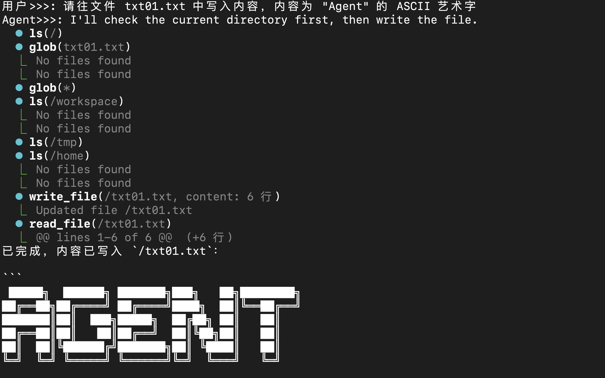
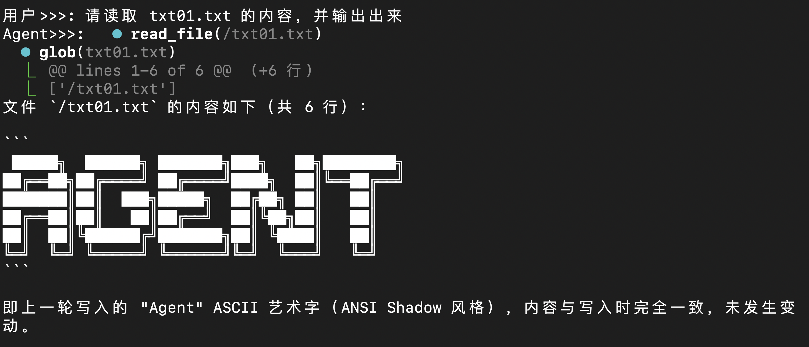
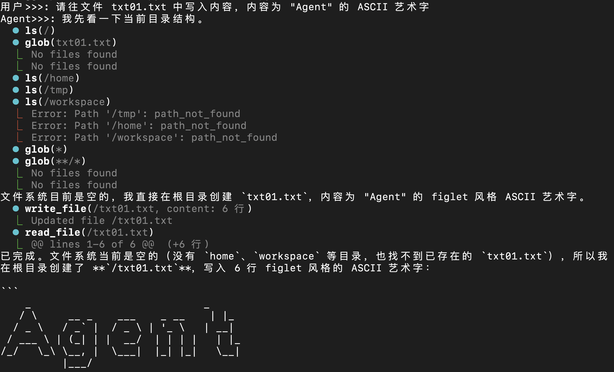
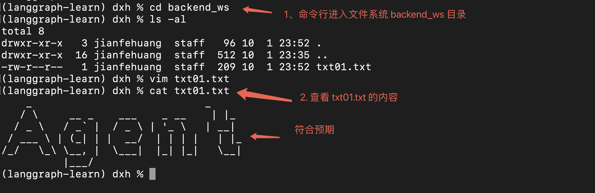
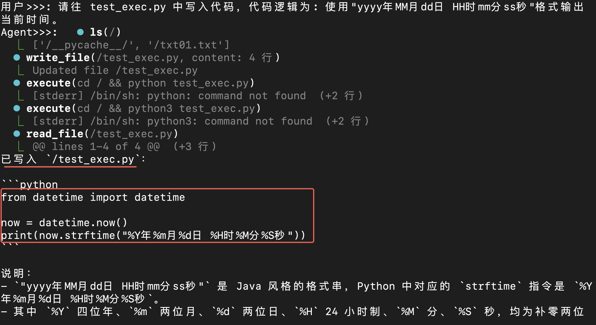
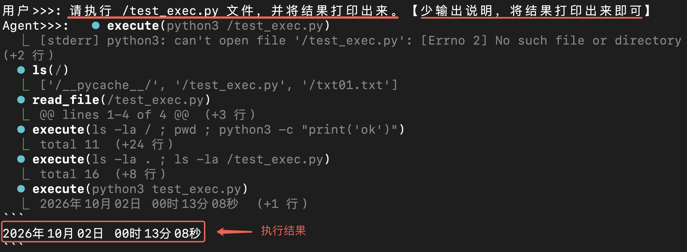
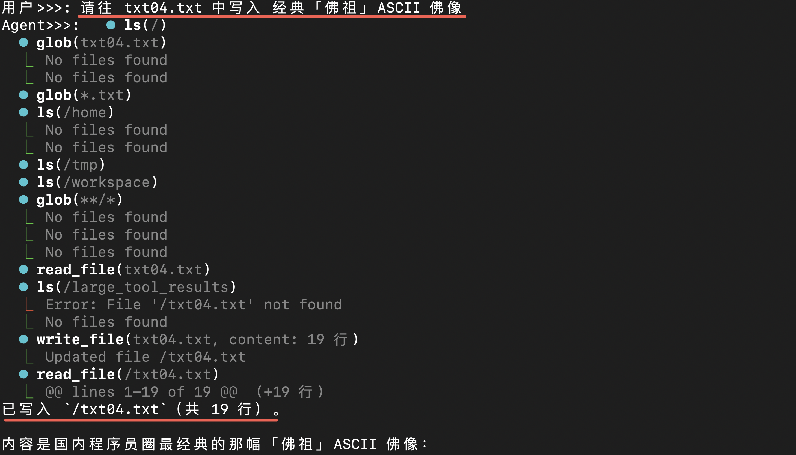
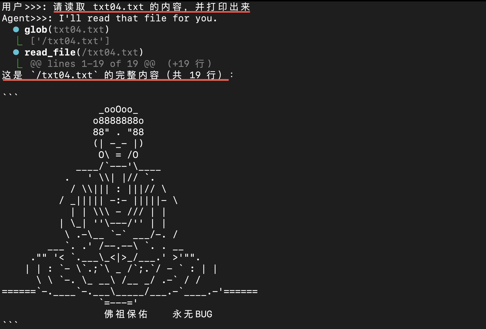
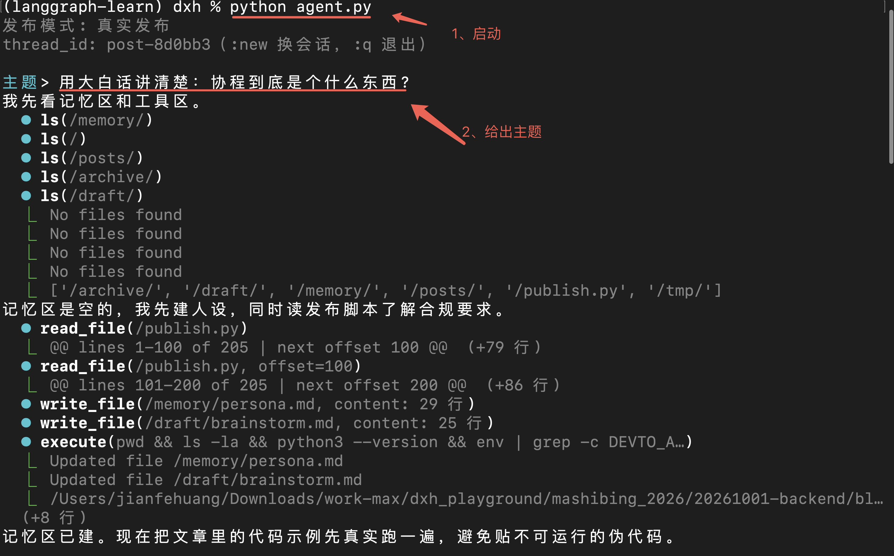
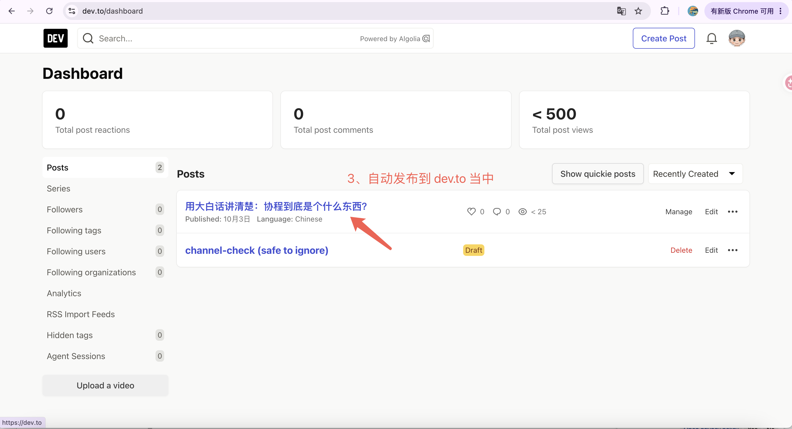

# LangChain 中的常用 backend

backend 在传统的软件定义中指后端，也就是服务器端。到了 AI 时代，LangChain / deepagents 里的 backend 指的是 "记忆的存储后端"。
按官方文档的定义，backend 主要暴露一套文件系统接口，用来存储和读取记忆。

deepagents 中常用的 backend 有 4 种：**StateBackend**、**FilesystemBackend**、**LocalShellBackend**、**StoreBackend**。

## 1. StateBackend

StateBackend 是默认 backend，它把 agent 当前线程的 state 作为存储文件信息的后端。这是一种临时的内存存储，agent 一退出，所有状态都会丢失。

```python
from deepagents import create_deep_agent
from deepagents.backends import StateBackend
from langgraph.checkpoint.memory import InMemorySaver
from langchain.chat_models import init_chat_model

# 【⚠️注意】这里依赖环境变量中已配置的 DEEPSEEK_API_KEY
ds_llm = init_chat_model('deepseek-v4-flash')

agent = create_deep_agent(
    model=ds_llm,
    tools=[],
    backend=StateBackend(), # <- 可以不配置这个参数，因为默认也是 StateBackend()
    checkpointer=InMemorySaver()
)
```

调用这个 agent，看看写入文件和读取文件的操作：

**1. 写入文件**



**2. 读取文件**




## 2. FilesystemBackend

FilesystemBackend 把本地磁盘的文件系统作为存储文件信息的后端，但它不支持 execute 工具。

```python
from deepagents import create_deep_agent
from deepagents.backends import FilesystemBackend
from langchain.chat_models import init_chat_model

# 【⚠️注意】这里依赖环境变量中已配置的 DEEPSEEK_API_KEY
ds_llm = init_chat_model('deepseek-v4-flash')

agent = create_deep_agent(
    model=ds_llm,
    tools=[],
    backend=FilesystemBackend(
        root_dir="./backend_ws", # <- 指定 agent 的 root_dir 为当前目录下的 backend_ws
        virtual_mode=True # <- 设置为 True，防止访问 root_dir 以外的文件，默认值为 False【建议开启】
    )
)
```

**1. 写入文件**



**2. 查看本地文件系统**



## 3. LocalShellBackend

LocalShellBackend 在 FilesystemBackend 的基础上，增加了对 execute 工具的支持。

```python
from deepagents import create_deep_agent
from deepagents.backends import LocalShellBackend
from langchain.chat_models import init_chat_model

# 【⚠️注意】这里依赖环境变量中已配置的 DEEPSEEK_API_KEY
ds_llm = init_chat_model('deepseek-v4-flash')

agent = create_deep_agent(
    model=ds_llm,
    tools=[],
    backend=LocalShellBackend(
        root_dir="./backend_ws",
        virtual_mode=True,
        env={
            "PATH": "/opt/miniconda3/envs/langgraph-learn/bin:/bin" # <- 设置 PATH，用于执行 Python 文件的解析器，需要根据自己本机的情况调整
        }
    )
)
```

**1. 写入文件**



**2. 执行 Python 文件**




## 4. StoreBackend

使用 langgraph 的 store 作为存储文件信息的后端。配置参数时，需要指定 store。

```python
from deepagents import create_deep_agent
from deepagents.backends import StoreBackend
from langgraph.store.memory import InMemoryStore
from langchain.chat_models import init_chat_model

# 【⚠️注意】这里依赖环境变量中已配置的 DEEPSEEK_API_KEY
ds_llm = init_chat_model('deepseek-v4-flash')

agent = create_deep_agent(
    model=ds_llm,
    tools=[],
    backend=StoreBackend(
        namespace=lambda run_time: (f"{run_time.execution_info.thread_id}",), # <- 指定 namespace
    ),
    store=InMemoryStore() # <- 指定 store，MemoryStore 保存到内存，也可以指定其他存储介质，保存到 Redis、Postgres 等
)

```

**1. 写入文件**



**2. 读取文件**



## 5. Backend 对比

| 探针                       | State                    | Filesystem                | LocalShell                                                 | Store                  |
| -------------------------- | ------------------------ | ------------------------- | ---------------------------------------------------------- | ---------------------- |
| 写完后磁盘上真的出现文件吗 | ✗                        | ✓                         | ✓                                                          | ✗                      |
| 换 thread_id 还能读到吗    | ✗                        | ✓                         | ✓                                                          | 看 namespace           |
| 进程退出后还在吗           | 看 checkpointer          | ✓                         | ✓                                                          | 看 store 实现          |
| 有 execute 工具吗          | ✗                        | ✗                         | ✓                                                          | ✗                      |
| **适用场景**               | 单会话临时草稿，用完即弃 | 让 agent 读写真实项目文件 | 跑脚本 / 装依赖 / 执行测试（无隔离，仅限本地或受信任环境） | 跨会话、多用户长期记忆 |

## 6. CompositeBackend

真实场景中，我们可能需要同时使用多个 backend，这时就可以用 CompositeBackend。

CompositeBackend 的两个重要参数：

1. default：默认backend，如果没有指定，那么默认是 StateBackend。
2. routes：根据不同的路径前缀，选择不同的backend。

代码示例：
```python
agent = create_deep_agent(
    model=ds_llm,
    tools=[],
    backend=CompositeBackend(
        default=StateBackend(),
        routes={
            "/backend_ws/": FilesystemBackend(
                root_dir="./backend_ws",
                virtual_mode=True
            ),
            "/shell_ws/": LocalShellBackend(
                root_dir="./shell_ws",
                virtual_mode=True,
                env={
                    "PATH": "/opt/miniconda3/envs/langgraph-learn:/bin"
                }
            )
        }
    ),
    store=InMemoryStore()
)
```

## 7. backend 实战

backend 本质上就是一套操作文件系统的接口，我们可以借助它来操作本地文件系统、实现一些功能。

我尝试用 backend 实现了一个能自主写博客、并推送到 dev.to 的 agent：只需要给它一个主题，它就能替我们创作。这有点像微缩版的 OpenClaw 或 WorkBuddy。


**1. 启动 + 运行**



**2. dev.to 中查看推送结果**

