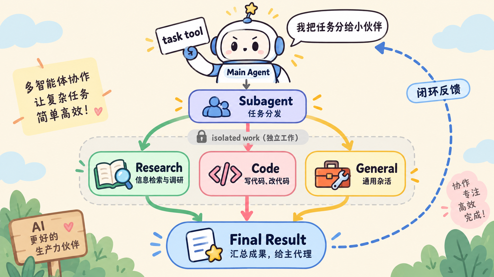
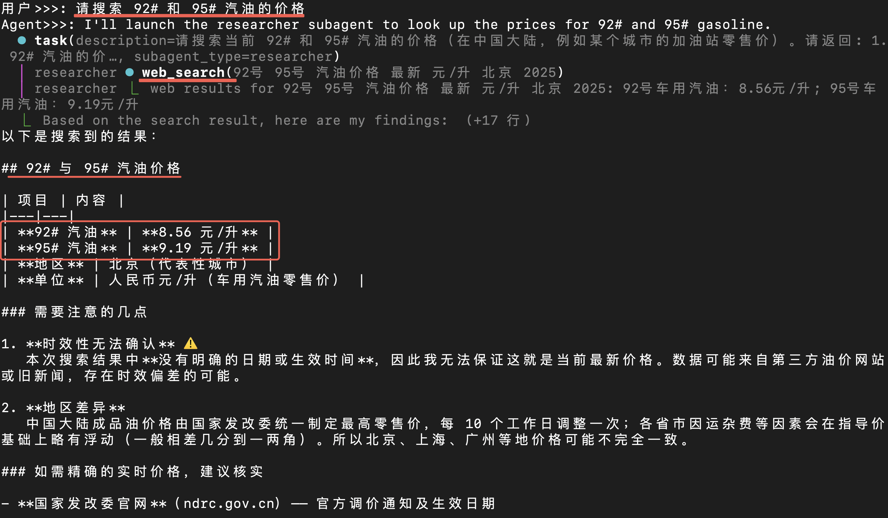
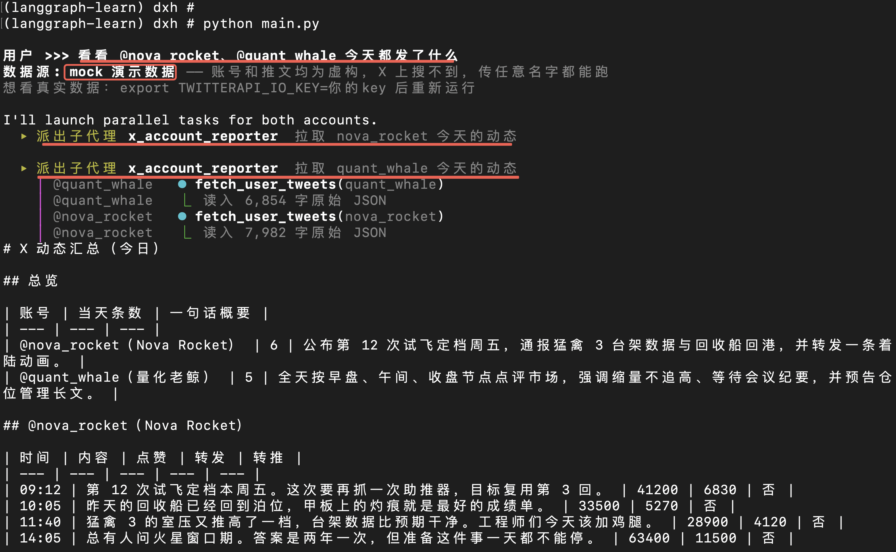

# LangChain 的 Subagents

## 1. subagent 介绍

在 ReAct 模式中，用单一 agent 处理所有问题时，最大的挑战是**上下文窗口爆炸**。尤其是在处理复杂任务时：

1. **网络搜索**：从互联网搜索信息，得到的内容可能特别多。
2. **多步骤任务**：每一个步骤都产生更多信息，导致上下文窗口快速增长。

使用 subagents 后，可以把任务拆分成多个子任务，每个子任务由一个独立的 agent 处理。这样每个 agent 只需要处理自己的子任务，上下文窗口不会快速增长；主 agent 只需要处理所有子任务的结果。



## 2. Deep Agent 中的 subagents

LangChain 的 Deep Agent 对 subagents 做了很好的封装：只需要给 `create_deep_agent` 函数传入一个 `subagents` 列表，就可以创建一个带有 **SubAgent** 的 Agent。

```python
from deepagents import create_deep_agent

main_agent = create_deep_agent(
    ...
    subagents=[],  # <- 传入 subagents 列表
    ...
)
```

创建 **SubAgent** 有两种方式：**字典配置**和 **CompiledSubAgent**。

### 2.1 字典配置 SubAgent

字典配置的常用字段：

| 字段 | 类型 | 说明 |
| --- | --- | --- |
| `name` | `str` | **必填**，SubAgent 名称 |
| `description` | `str` | **必填**，详细描述该子代理的功能 |
| `system_prompt` | `str` | 系统提示词 |
| `model` | — | 用于覆盖主智能体的模型；省略此参数则使用主智能体的模型 |
| `tools` | `list` | 子代理可以使用的工具。建议只列出真正必要的工具 |
| `mode` | `str` | `"isolated"` \| `"fork"`，默认为 `"isolated"`。<br>`"isolated"`：子代理只能看到被委托的任务；<br>`"fork"`：子代理会继承父代理的对话内容及系统提示 |

```python
def web_search(query: str) -> str:
    """Search the web."""
    return f"""web results for {query}: 92号车用汽油：8.56元/升;
95号车用汽油：9.19元/升"""

research_subagent = {
    "name": "researcher",
    "description": "Researches topics and returns structured findings",
    "system_prompt": (
        "你是一个 research SubAgent。"
        "针对该主题调用一次 web_search，然后立即返回你的发现。"
    ),
    "tools": [web_search],
}

subagents = [research_subagent]
```

### 2.2 CompiledSubAgent 创建 SubAgent

如果使用 `create_agent` 函数，或者使用 LangGraph 创建 Agent，那么需要使用 `CompiledSubAgent` 创建 SubAgent。

```python
def web_search(query: str) -> str:
    """Search the web."""
    return f"""web results for {query}: 92号车用汽油：8.56元/升;
95号车用汽油：9.19元/升"""

# 使用 create_agent 创建一个 Agent（底层是 LangGraph）
custom_graph = create_agent(
    model=ds_llm,
    tools=[web_search],
    system_prompt="You are a specialized agent for web search",
)

# 通过 CompiledSubAgent 创建一个 SubAgent
custom_subagent = CompiledSubAgent(
    name="researcher",
    description="一个做 web 搜索的智能体。",
    runnable=custom_graph,
)

subagents = [custom_subagent]
```

实现效果截图：



## 3. SubAgent 实战

有了 SubAgent，就可以做一些有意思的事情。比如我们想要关注 X 上某些神人的帖子，就可以**把每一个账号做成一个 SubAgent**，然后让这些 SubAgent 分别拉取 X 的帖子并总结输出，最后主 Agent 再将所有 SubAgent 的输出汇总起来。


