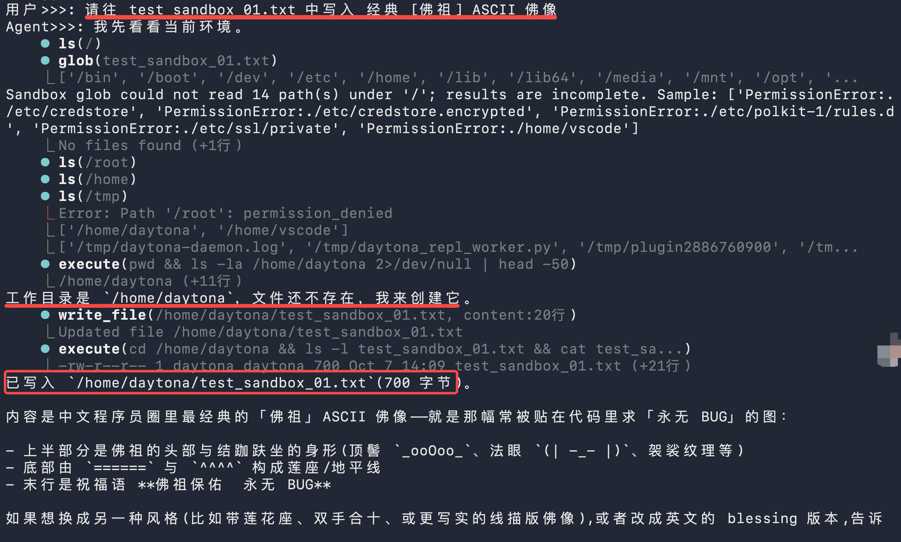
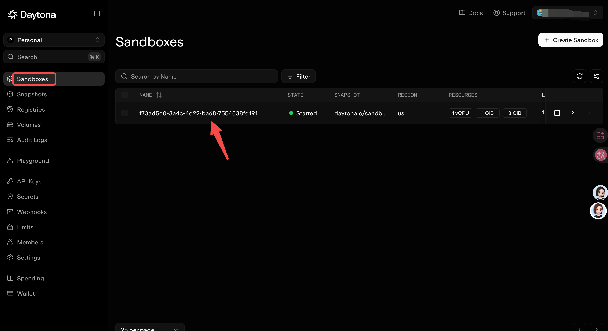
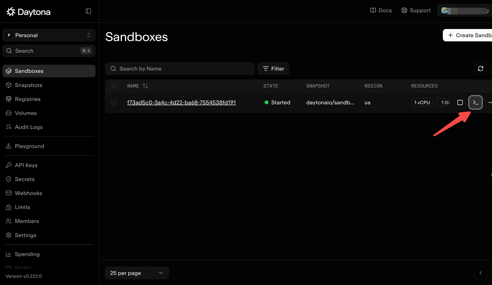
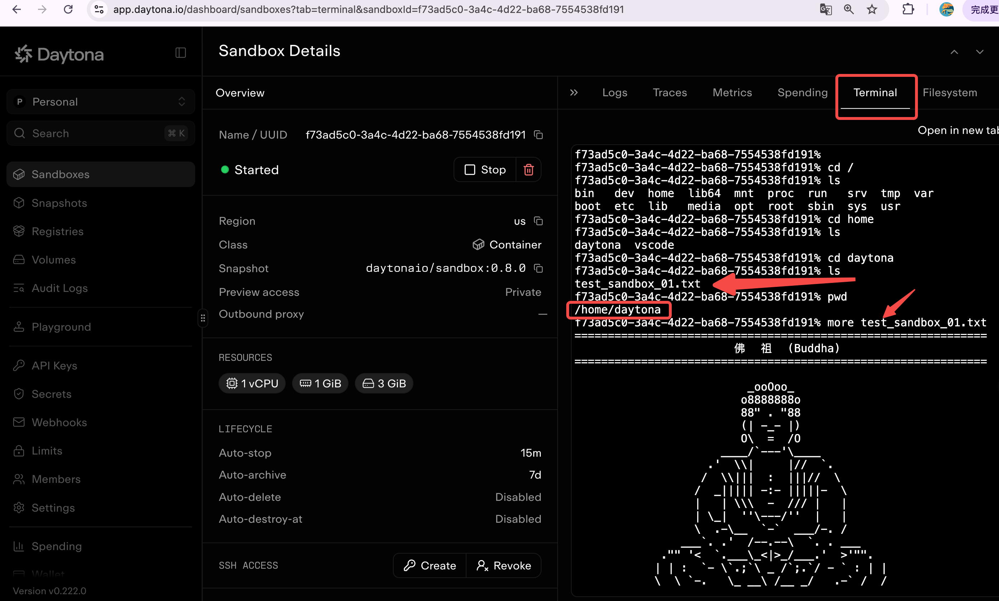

# 1. 沙箱介绍

Agent 会写代码、读写文件、执行 shell，但你没法预测它到底会做什么。沙箱（Sandbox）要解决的，就是给它划出一块**隔离的执行环境**：让 Agent 随便折腾，同时碰不到你主机的凭据、文件和网络。

在 Deep Agents 里，沙箱本质上是一种 **backend（后端）**。和 State / Filesystem / Store 这些只做文件操作的 backend 不同，沙箱 backend 额外给 Agent 一个 `execute` 工具，用来在隔离环境里跑任意 shell 命令。一旦配置了沙箱 backend，Agent 就会获得：

- 全套文件系统工具：`ls`、`read_file`、`write_file`、`edit_file`、`delete`、`glob`、`grep`
- 一个 `execute` 工具，用来在沙箱里执行命令
- 一道保护宿主机的安全边界

典型场景：

- **编码 Agent**：自动跑 shell、`git clone`、Docker-in-Docker 做构建与测试（不少厂商提供原生 git API，例如 Daytona）。
- **数据分析 Agent**：加载文件、安装 pandas/numpy、跑统计、产出 PPT，全程在隔离环境里完成。

一句话：沙箱的价值在**安全**——让 Agent 能自主干活，却不至于把你的机器一起赔进去。

# 2. 沙箱提供商

| 提供商 | 集成类 | 特点 |
| --- | --- | --- |
| Daytona | `DaytonaSandbox` | 提供一定的免费额度，适合学习、练手；有原生 git 操作，支持 Docker-in-Docker |
| Vercel | `VercelSandbox` | 依托 Vercel 平台，按 runtime（如 `python3.13`）创建沙箱 |
| OpenSandbox | `OpenSandboxBackend` | 开源沙箱项目，可以独立部署，适合自建与私有化 |
| LangSmith | `LangSmithSandbox` | LangChain 官方一方托管沙箱，无需第三方账号，自带快照、service URL 与 auth proxy |
| AgentCore | `AgentCoreSandbox` | AWS Bedrock AgentCore 提供的托管沙箱，适合 AWS 生态用户 |
| E2B | `E2BSandbox` | 面向 AI 代码执行的云端沙箱，生态成熟、上手快 |
| Modal | `ModalSandbox` | Serverless 云平台 Modal 的沙箱，按需伸缩、免运维 |
| Runloop | `RunloopSandbox` | 以 devbox 为单位的云端开发环境沙箱 |

# 3. daytona

```shell
pip install daytona langchain-daytona
```

下面这段就是本项目 `sandbox_agent.py` 里的实际代码：用 Daytona 拉起一个沙箱，包装成 backend 交给 deep agent。

```python
from dotenv import dotenv_values

from deepagents import create_deep_agent

from daytona import Daytona, DaytonaConfig
from langchain_daytona import DaytonaSandbox

from llm import ds_llm

env_config = dotenv_values(".env")

config = DaytonaConfig(api_key=env_config["DAYTONA_API_KEY"])
sandbox = Daytona(config).create()
backend = DaytonaSandbox(sandbox=sandbox)

agent = create_deep_agent(
    model=ds_llm,
    tools=[],
    backend=backend,
)
```

几点说明：

- `Daytona(config).create()` 负责在云端拉起沙箱，`DaytonaSandbox(sandbox=...)` 把它包装成 deep agent 可用的 backend。
- 配置完成后，文件工具和 `execute` 工具都由 backend 自动提供，所以 `tools=[]`，不用再手动传。
- 所有命令都在远端沙箱里执行，本机与凭据不受影响。

> 踩坑提示：如果创建时报 `This organization does not have a default region`，说明没有指定区域。在 `.env` 里加一行 `DAYTONA_TARGET=<你的区域>`，或者去 Daytona Dashboard 设置默认 region 即可。

**1. 发起调用**


**2. 在 app.daytona.io 查看**


**3. 沙箱终端入口**


**4. 登陆沙箱查看**
